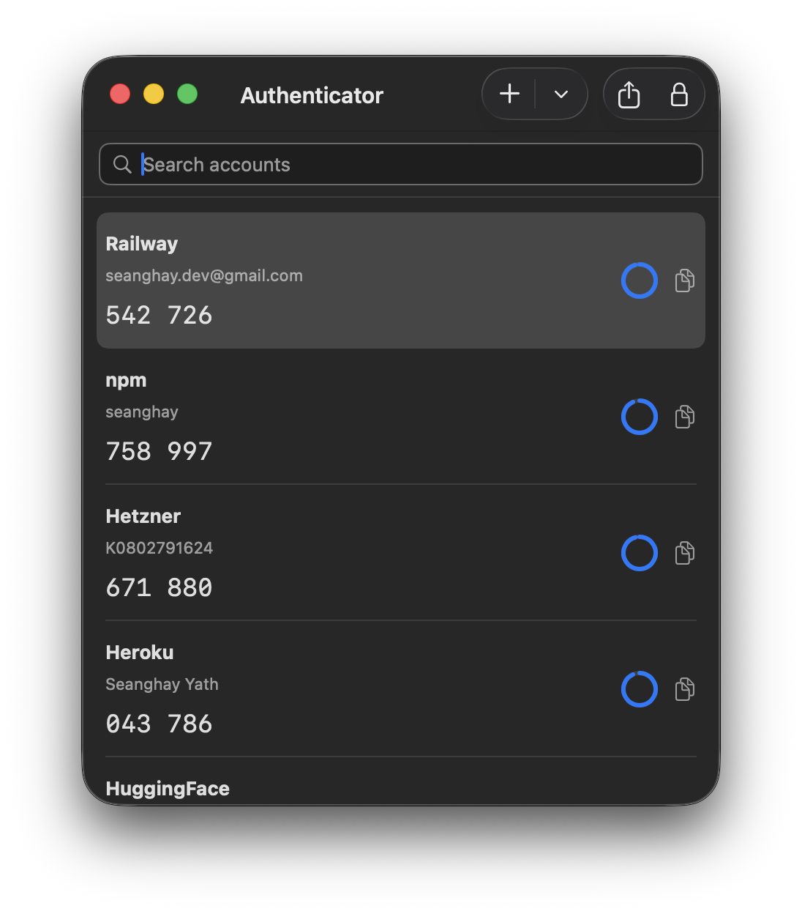
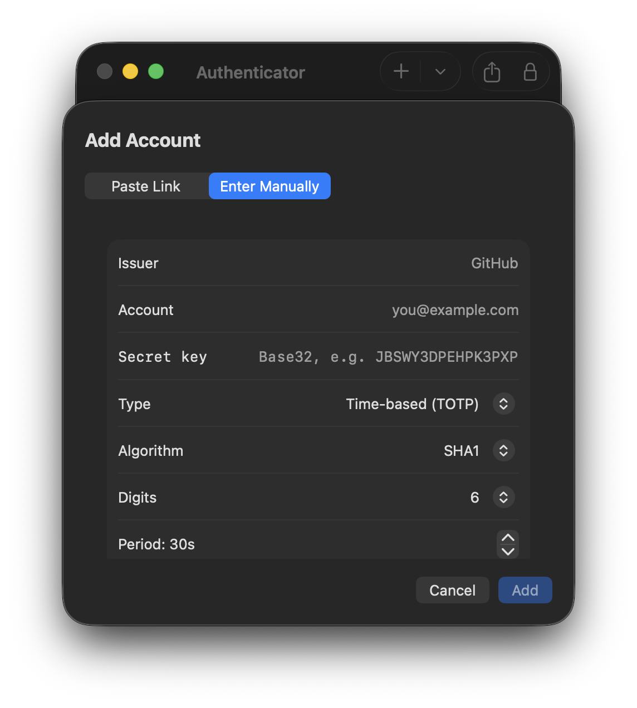

# Authenticator

A native macOS app for your two-factor codes.

Scan a QR code, search, click a row to copy. Locked behind Touch ID, encrypted on disk, and entirely offline — the app has no network entitlement at all.



## Features

- **TOTP and HOTP**, SHA-1/SHA-256/SHA-512, 6–8 digits, custom periods
- **Import** by camera, image file, drag and drop, the Photos library, or a pasted `otpauth://` link
- **Move from your phone in one shot** — reads Google Authenticator's *Transfer accounts* QR codes, and writes them too
- **Export** a per-account QR for any other authenticator, or a batch transfer code to go back to a phone
- **Search and click to copy**, with an optional timed clipboard wipe
- **Touch ID lock** at launch and after an idle timeout, falling back to your login password
- **Encrypted vault** — AES-GCM on disk, key in the Keychain, nothing in the clear

## Install

Download the DMG from [Releases](https://github.com/seanghay/Authenticator/releases) and drag Authenticator to Applications.

The build is ad-hoc signed and **not notarized**, so macOS quarantines it and refuses to open it. Clear the flag once, after installing:

```sh
xattr -dr com.apple.quarantine /Applications/Authenticator.app
```

Then open Authenticator normally. You only need to do this once per download.

> **Back up before you upgrade a DMG build.** Ad-hoc signed builds have no stable
> code-signing identity — every release is a different one as far as macOS is
> concerned — so after replacing the app, macOS may prompt before letting it read
> its own vault key from the Keychain, and denying that prompt locks you out of
> your accounts. Export your accounts first (**File ▸ Export Accounts…**), or
> build from source with your own signing team, which gives the app a stable
> identity and avoids the problem entirely.

## Adding an account by hand

When there's no QR code to scan, type the secret in directly.



## Requirements

- macOS 15 or later
- Xcode 26 or later (to build)

## Build

```sh
open Authenticator.xcodeproj
```

Then press ⌘R. Set your own team under Signing & Capabilities for a stable signing identity.

From the command line:

```sh
xcodebuild -project Authenticator.xcodeproj -scheme Authenticator \
  -configuration Debug -destination 'platform=macOS,arch=arm64' build
```

## Tests

```sh
xcodebuild test -project Authenticator.xcodeproj -scheme Authenticator \
  -destination 'platform=macOS,arch=arm64'
```

51 tests covering the parts where being subtly wrong is worse than crashing:

- RFC 4226 and RFC 6238 published vectors for all three hash algorithms
- RFC 4648 base32 vectors, plus round-trips over every byte length
- `otpauth://` parse/serialize fixed-point tests, including the awkward real-world labels
- A **byte-level golden test** on the Google Authenticator protobuf — a round-trip alone would happily agree with itself even with every field number wrong
- Vault encryption, tamper detection, and backup recovery
- Keychain reads and writes from inside the real App Sandbox
- QR render → decode round-trips through the actual pipeline

## Where your data lives

Everything is in one AES-GCM encrypted file inside the app's sandbox container:

```
~/Library/Containers/com.seanghay.Authenticator/Data/Library/Application Support/Authenticator/vault.dat
```

The 256-bit key is a Keychain item. Issuer and account names are inside the encrypted blob rather than in Keychain attributes, so they don't show up in Keychain Access. There is no account, no sync, no network code, and no analytics — the app ships without the network entitlement, so it cannot phone home even by accident.

The Touch ID lock is enforced by the app, not by the cryptography. Making the key itself require biometrics needs `kSecAttrAccessControl`, which requires a provisioning profile; the code is structured so that is a contained change if you have one.

## Keyboard shortcuts

| Shortcut | Action |
| --- | --- |
| ⌘N | Add account |
| ⌘O | Import from image |
| ⌘⇧S | Scan with camera |
| ⌘E | Export accounts |
| ⌘F | Search |
| ⌘⇧C | Copy the selected code |
| ⌘L | Lock now |

## Releases

Pushing a `v*` tag builds the DMG on CI and publishes it as a GitHub release:

```sh
git tag v1.0.0
git push origin v1.0.0
```

## License

[MIT](LICENSE)
